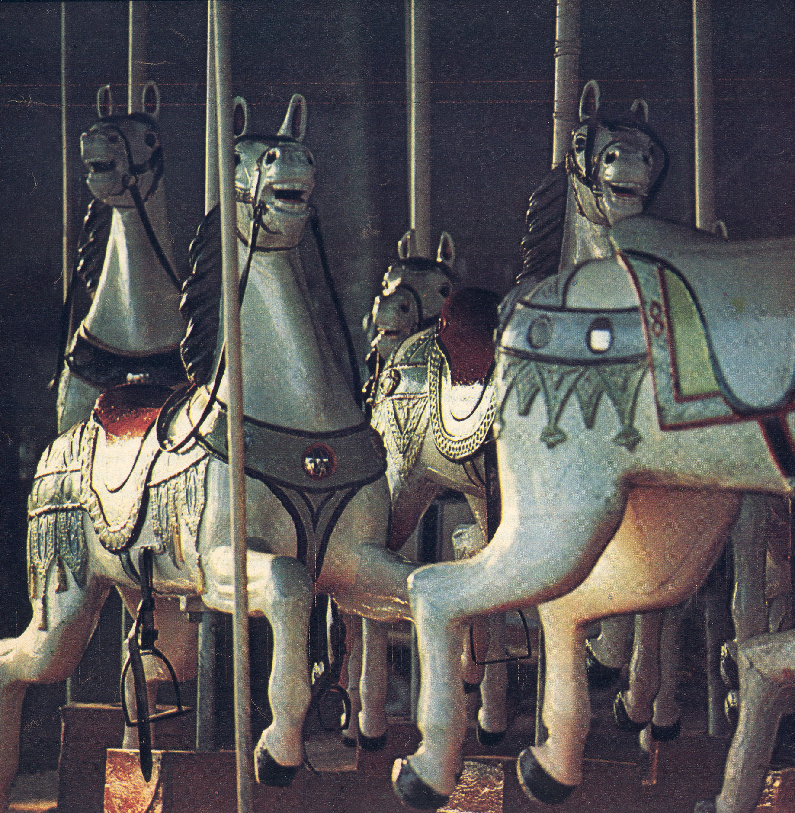

*Image credit: "Paardenmolen bobbejaanland". [Wikipedia](https://commons.wikimedia.org/wiki/File:Paardenmolen_bobbejaanland.jpg#file)*

Confession time: I used to think carousels were a good idea and I was wrong.

If you haven't seen it yet: [http://shouldiuseacarousel.com/](http://shouldiuseacarousel.com/) demonstrates through annoying use of a carousel, exactly why you should never use a carousel on a website.

The site explains why carousels are a bad idea, but why did I think they were a good idea? My belief was based on the idea that the carousel makes more use of the limited screen real estate by putting more content in the same number of pixels. "Real estate" is a dated term, and the whole idea comes from the flawed idea of keeping content "above the fold".

<!-- more -->

Notice the chain of flawed reasoning? "Above the fold" is a concept from print—put the most important stories above the physical fold on your newspaper, because when they're stacked on the newsstand, nobody sees the bottom half. Sure, few people click farther down the page—but if they're not going to scroll, they're even less likely to wait for 20 seconds to see some relevant content.

When you build a website, you naturally think it's the most valuable and interesting stuff ever to grace the Internet. It's not. Most of the visitors to your site are not interested in it. (Check your analytics.) Try this: think of your page as a filter to separate the interested parties from the disinterested. You're panning for gold—success depends on how quickly you can tell the few percent of interested parties what the site is about while sending the disinterested parties back on their way. Cluttering the page will annoy users. Don't annoy users.

Us web builders get some silly ideas sometimes. Flash... frames... blink tag... Don't beat yourself up. Just let go and move on. And remember that your visitors' time is valuable.

In other news, I'm working on a browser plugin for a &lt;metallic&gt; tag—for extra shiny!!!
